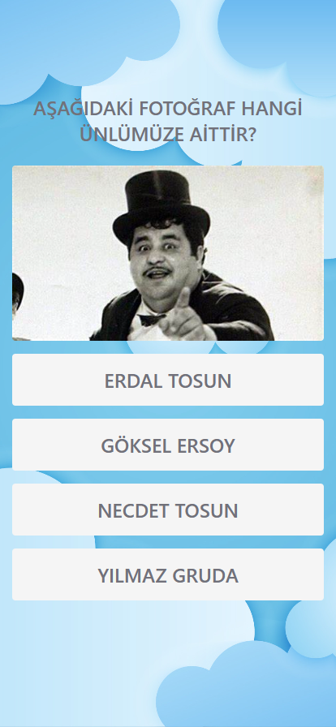

# Technical Documentation

**English** | [Türkçe](/TechnicalDocumentation-TR.md)

Content:

- [About](#about)

- [Languages Used](#languages-used)

- [Libraries Used](#used-libraries)

- [Used in the Development Process Programs](#programs-used-in-development-process)

- [Development Environment](#development-environment)

- [Interface](#interface)

- [Back End](#back-end)

- [Publishing](#publishing)

- [Version Control](#version-control)

- [Testing](#test-etme)

- [QR Code](#qr-code)

- [Sound Files-Effects](#sound-files-effects)

- [Images](#images)

- [Images from the app](#images-from-the-app)

### About

Python Flask based, open source, Burhaniye region for children
is a web page made to introduce a game format in a fun way.
Application.

### Languages Used

- [Python](https://www.python.org/)
  [v3.12.0](https://www.python.org/downloads/release/python-3120/)

- [JavaScript](https://www.javascript.com/)
  [vES14](https://ecma-international.org/publications-and-standards/standards/ecma-262/)

- [HTML5](https://dev.w3.org/html5/spec-LC/)

- [CSS3](https://www.w3.org/Style/CSS/Overview.en.html)

### Used Libraries

- [Flask v3.0.0](https://flask.palletsprojects.com/en/3.0.x/)

- [Jinja2 v3.1.2](https://jinja.palletsprojects.com/en/3.1.x/)

- [Socket v1.0.0](https://docs.python.org/3/library/socket.html)

- [Secrets v1.0.0](https://docs.python.org/3/library/secrets.html)

- [TailwindCSS](https://tailwindcss.com/)
  [v3.4.1](https://github.com/tailwindlabs/tailwindcss/releases/tag/v3.4.1)

### Programs Used in the Development Process

- [Visual Studio Code](https://code.visualstudio.com/)
  [v1.85.1](https://code.visualstudio.com/updates/v1_85) (code editor)

- [GitHub Desktop v3.3.6](https://desktop.github.com/) (Git interface)

- [Windows Terminal](https://github.com/microsoft/terminal)
  [v1.18.3181.0](https://github.com/microsoft/terminal/releases/tag/v1.18.3181.0)
  (terminal interface)

- [Git Bash](https://git-scm.com/)
  [v2.43.0](https://raw.githubusercontent.com/git/git/master/Documentation/RelNotes/2.43.0.txt)
  (terminal)

### Development Environment

- Operating System: [Windows 11 Pro 23H2
  v22631.2861](https://support.microsoft.com/en-gb/topic/december-12-2023-kb5033375-os-builds-22621-2861-and-22631-2861-90f983aa-efb6-4caa-9cab-7e5cfa00ed36)

- Motherboard [MSI A320M PRO-VH
  PLUS](https://www.msi.com/Motherboard/A320M-PRO-VH-PLUS/Specification)
  \| BIOS v7B073E

- Processor: [AMD Ryzen 5
  5600](https://www.amd.com/en/products/cpu/amd-ryzen-5-5600)

- RAM: [Corsair Vengeance LPX 2 x 8GB DDR4 3600MHz
  C18](https://www.corsair.com/us/en/p/memory/cmk16gx4m2d3600c18/vengeancea-lpx-16gb-2-x-8gb-ddr4-dram-3600mhz-c18-memory-kit-black-cmk16gx4m2d3600c18)

- Video Card: [Sapphire Pulse AMD Radeon RX
  6600](https://www.sapphiretech.com/en/consumer/pulse-radeon-rx-6600-8g-gddr6)

### Front-End

HTML5 and Jinja2 were used in the interface of the application. Interface
TailwindCSS is used in styling except for the background image
CSS3 is used only for the background image. Sound in the interface
JavaScript is used to play the effects. Also JavaScript,
If a "404 Page Not Found" error is received, the user will be prompted to start
page automatically.

### Back-End

Flask, a Python web library, was used on the server side.
Flask was chosen because it is a simple and fast library.
Apart from Flask, Python's own "secrets" and "socket"
libraries are also used. Socket is the local
was used to access the IP address of the computer. Secrets, 32
is used to generate a random secret password with characters. This password
The secret key to the Flask application.

### Deployment

Our Flask-based application
[PythonAnyWhere.com](https://www.pythonanywhere.com/) for free
published in some way. Python in the application development process
Despite using version 3.12.0, the release on PythonAnyWhere
used version 3.10.0 of Python in its release. The reason for this
The latest Python version supported by PythonAnyWhere is 3.10.0
is

### Version Control

Git is used for version control. The application is fully open source
is coded. [All code from GitHub
available at](https://github.com/DogukanUrker/BurhaniyeAPP)

### Testing

In the application development process, [Microsoft Edge DevTools
v119](https://learn.microsoft.com/en-us/microsoft-edge/devtools-guide-chromium/overview)
and [Safari v17.2](https://developer.apple.com/safari/) on iPhone 11
tested using

### QR Code

For QR code [QR Code Generator](https://www.qr-code-generator.com/)
is used. QR code in "<https://burhaniyem.pythonanywhere.com/>"
link is embedded.

### Audio Files-Effects

All sound files and effects are in "mp3" format. This is because mp3
file extension by almost all web browsers
support Sound effects (applause, right and wrong answer)
Retrieved from [pixabay](https://pixabay.com/sound-effects/) Sound
files (audio narrations) on Samsung Note 10, HUAWEI MateBook D 15
and iPhone 11 devices. The recordings were recorded in "m4a" or
From "ogg" format at [Convertio](https://convertio.co/)
and converted into "mp3" format.

### Images

Background image [Creative Fabrica](https://www.creativefabrica.com/)
taken from the website. For other images [Google
Images](https://images.google.com/) and [Bing
Images](https://www.bing.com/images) was used. File format
"png", "jpeg", "webp" and "jfif" were used.

### Images from the Application

Click on the text below the images to go to the URL from which they were taken
you can go to

[Home Page](https://burhaniyem.pythonanywhere.com/)

[History of Burhaniye](https://burhaniyem.pythonanywhere.com/tarihce)

[Soru-10](http://soru10)

[Congratulations-5](https://burhaniyem.pythonanywhere.com/tebrikler5)

[Question-4](https://burhaniyem.pythonanywhere.com/soru4) \|
[Congratulations-1](https://burhaniyem.pythonanywhere.com/tebrikler1)
