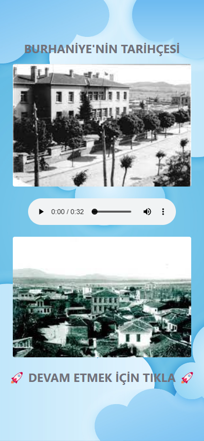
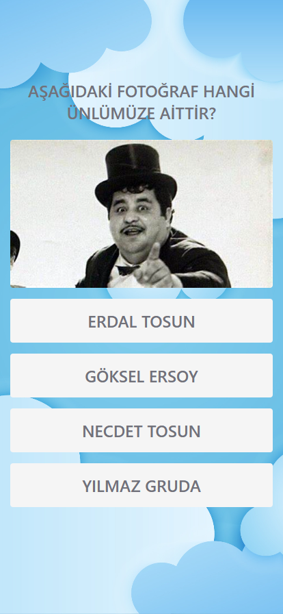
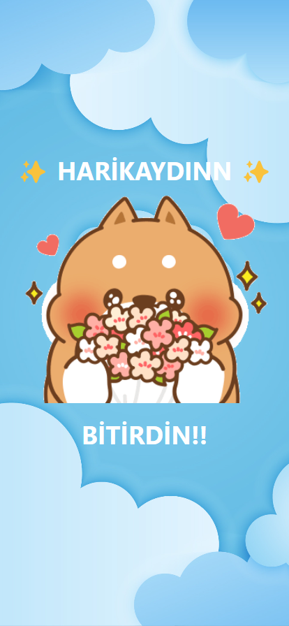

# Teknik Dokümantasyon

[English](/TechnicalDocumentation-EN.md) | **Türkçe**

İçerik:

- [Hakkında](#hakkında)

- [Kullanılan Diller](#kullanılan-diller)

- [Kullanılan Kütüphaneler](#kullanılan-kütüphaneler)

- [Geliştirme Sürecinde Kullanılan
  Programlar](#geliştirme-sürecinde-kullanılan-programlar)

- [Geliştirme Ortamı](#geliştirme-ortamı)

- [Arayüz](#arayüz)

- [Arka Uç](#arka-uç)

- [Yayınlanma](#yayınlanma)

- [Sürüm Kontrol](#sürüm-kontrol)

- [Test Etme](#test-etme)

- [QR Kod](#qr-kod)

- [Ses Dosyaları-Efektleri](#ses-dosyaları-efektleri)

- [Görseller](#görseller)

- [Uygulamadan Görseller](#uygulamadan-görseller)

### Hakkında

Python Flask tabanlı, açık kaynak kodlu, Burhaniye bölgesini çocuklara
eğlenceli bir şekilde oyun formatında tanıtmak için yapılmış bir web
uygulaması.

### Kullanılan Diller

- [Python](https://www.python.org/)
  [v3.12.0](https://www.python.org/downloads/release/python-3120/)

- [JavaScript](https://www.javascript.com/)
  [vES14](https://ecma-international.org/publications-and-standards/standards/ecma-262/)

- [HTML5](https://dev.w3.org/html5/spec-LC/)

- [CSS3](https://www.w3.org/Style/CSS/Overview.en.html)

### Kullanılan Kütüphaneler

- [Flask v3.0.0](https://flask.palletsprojects.com/en/3.0.x/)

- [Jinja2 v3.1.2](https://jinja.palletsprojects.com/en/3.1.x/)

- [Socket v1.0.0](https://docs.python.org/3/library/socket.html)

- [Secrets v1.0.0](https://docs.python.org/3/library/secrets.html)

- [TailwindCSS](https://tailwindcss.com/)
  [v3.4.1](https://github.com/tailwindlabs/tailwindcss/releases/tag/v3.4.1)

### Geliştirme Sürecinde Kullanılan Programlar

- [Visual Studio Code](https://code.visualstudio.com/)
  [v1.85.1](https://code.visualstudio.com/updates/v1_85) (kod editörü)

- [GitHub Desktop v3.3.6](https://desktop.github.com/) (Git arayüzü)

- [Windows Terminal](https://github.com/microsoft/terminal)
  [v1.18.3181.0](https://github.com/microsoft/terminal/releases/tag/v1.18.3181.0)
  (terminal arayüzü)

- [Git Bash](https://git-scm.com/)
  [v2.43.0](https://raw.githubusercontent.com/git/git/master/Documentation/RelNotes/2.43.0.txt)
  (terminal)

### Geliştirme Ortamı

- İşletim Sistemi: [Windows 11 Pro 23H2
  v22631.2861](https://support.microsoft.com/en-gb/topic/december-12-2023-kb5033375-os-builds-22621-2861-and-22631-2861-90f983aa-efb6-4caa-9cab-7e5cfa00ed36)

- Anakart: [MSI A320M PRO-VH
  PLUS](https://www.msi.com/Motherboard/A320M-PRO-VH-PLUS/Specification)
  \| BIOS v7B073E

- İşlemci: [AMD Ryzen 5
  5600](https://www.amd.com/en/products/cpu/amd-ryzen-5-5600)

- RAM: [Corsair Vengeance LPX 2 x 8GB DDR4 3600MHz
  C18](https://www.corsair.com/us/en/p/memory/cmk16gx4m2d3600c18/vengeancea-lpx-16gb-2-x-8gb-ddr4-dram-3600mhz-c18-memory-kit-black-cmk16gx4m2d3600c18)

- Ekran Kartı: [Sapphire Pulse AMD Radeon RX
  6600](https://www.sapphiretech.com/en/consumer/pulse-radeon-rx-6600-8g-gddr6)

### Arayüz

Uygulamanın arayüzünde HTML5 ve Jinja2 kullanılmıştır. Arayüzün
stillendirilmesinde arka plan görseli hariç TailwindCSS kullanılmıştır
yalnızca arka plan görseli için CSS3 kullanılmıştır. Arayüzdeki ses
efektlerini oynatmak için JavaScript kullanılmıştır. Ayrıca JavaScript,
"404 Page Not Found" hatası alındığı taktirde kullanıcıyı başlangıç
sayfasına otomatik olarak yönlendirmesi için de kullanılmıştır.

### Arka Uç

Sunucu tarafında bir Python web kütüphanesi olan Flask kullanılmıştır.
Flask tercih edilmesinin sebebi, basit ve hızlı bir kütüphane olmasıdır.
Flask dışında Python'ın kendi içinde dahil olan "secrets" ve "socket"
kütüphaneleri de kullanılmıştır. Socket, uygulamanın çalıştığı yerel
bilgisayarın IP adresine ulaşmak için kullanılmıştır. Secrets, 32
karakterli rastgele gizli bir şifre oluşturmak için kullanılır. Bu şifre
Flask uygulamasının gizli anahtarıdır.

### Yayınlanma

Flask tabanlı uygulamamız
[PythonAnyWhere.com](https://www.pythonanywhere.com/) sayesinde ücretsiz
bir şekilde yayınlanmıştır. Uygulama geliştirme sürecinde Python'ın
3.12.0 sürümünü kullanmasına rağmen, PythonAnyWhere'deki yayınlanma
sürümünde Python'ın 3.10.0 sürümünü kullanmıştır. Bunun sebebi
PythonAnyWhere sitesinin desteklediği en güncel Python sürümünün 3.10.0
olmasıdır.

### Sürüm Kontrol

Sürüm kontrol için Git kullanılmıştır. Uygulama tamamen açık kaynak
kodludur. [GitHub'dan tüm kodlara
erişebilirsiniz.](https://github.com/DogukanUrker/BurhaniyeAPP)

### Test Etme

Uygulama geliştirme sürecinde, [Microsoft Edge DevTools
v119](https://learn.microsoft.com/en-us/microsoft-edge/devtools-guide-chromium/overview)
ve iPhone 11'de [Safari v17.2](https://developer.apple.com/safari/)
kullanılarak test edilmiştir.

### QR Kod

QR kod için [QR Code Generator](https://www.qr-code-generator.com/)
kullanılmıştır. QR kod içinde "<https://burhaniyem.pythonanywhere.com/>"
bağlantısı gömülüdür.

### Ses Dosyaları-Efektleri

Bütün ses dosyaları ve efektleri "mp3" formatındadır. Bunun sebebi mp3
dosya uzantısının neredeyse tüm web tarayıcıları tarafından
desteklenmesidir. Ses efektleri (alkış, doğru ve yanlış cevap)
[pixabay](https://pixabay.com/sound-effects/) sitesinden alınmıştır. Ses
dosyaları (sesli anlatımlar) ise Samsung Note 10, HUAWEI MateBook D 15
ve iPhone 11 cihazlarıyla kayıt alınmıştır. Alınan kayıtlar "m4a" veya
"ogg" formatından [Convertio](https://convertio.co/) sitesinden
yararlanılarak "mp3" formatına dönüştürülmüştür.

### Görseller

Arkaplan görseli [Creative Fabrica](https://www.creativefabrica.com/)
sitesinden alınmıştır. Diğer görseller için [Google
Images](https://images.google.com/) ve [Bing
Images](https://www.bing.com/images) kullanılmıştır. Dosya formatı
olarak "png", "jpeg", "webp" ve "jfif" kullanılmıştır.

### Uygulamadan Görseller

Görsellerin altındaki yazılara tıklayarak alındıkları URL'ye
gidebilirsiniz.

[Giriş Sayfası](https://burhaniyem.pythonanywhere.com/)

[Burhaniye'nin Tarihçesi](https://burhaniyem.pythonanywhere.com/tarihce)

[Soru-10](http://soru10)

[Tebrikler-5](https://burhaniyem.pythonanywhere.com/tebrikler5)

[Soru-4](https://burhaniyem.pythonanywhere.com/soru4) \|
[Tebrikler-1](https://burhaniyem.pythonanywhere.com/tebrikler1)
